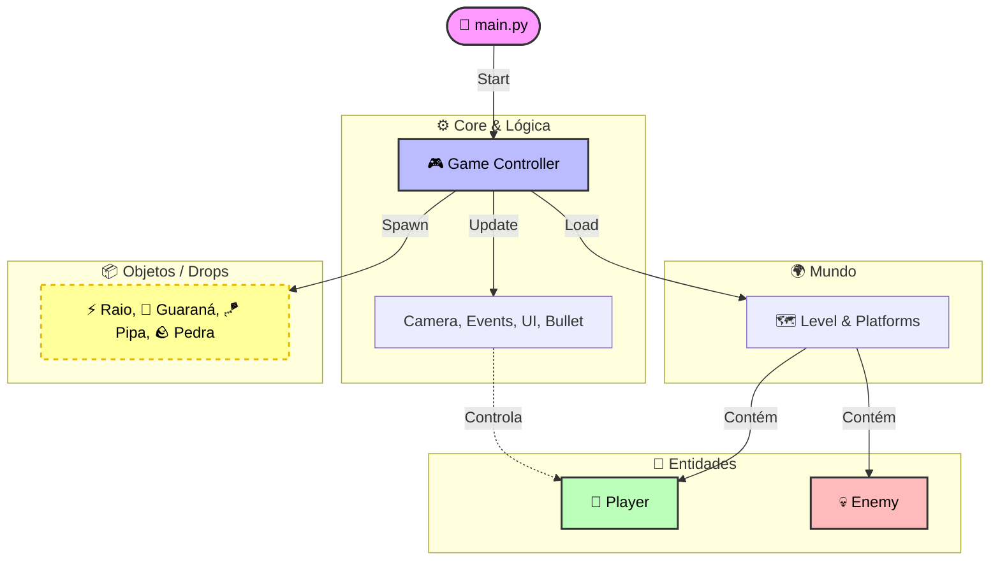

# Helicônia

> **Status do Projeto:** Em desenvolvimento

O jogo retrata a história de **Helicônia**, uma guerreira indígena abençoada por **Tupã** para derrotar o domínio de **Anhangá**.

## Equipe 💻

<table>
  <tr>
    <td align="center">
      <a href="https://github.com/CauaEmano">
        <br>
        <sub><b>Cauã Emanuel</b></sub>
      </a>
    </td>
    <td align="center">
      <a href="https://github.com/MarcosMorais5228">
        <br>
        <sub><b>Marcos</b></sub>
      </a>
    </td>
    <td align="center">
      <a href="https://github.com/Juaum-zim">
        <br>
        <sub><b>João Pedro</b></sub>
      </a>
    </td>
    <td align="center">
      <a href="https://github.com/allanismaia42-boop">
        <br>
        <sub><b>Allanis</b></sub>
      </a>
    </td>
    <td align="center">
      <a href="https://github.com/ellesamarasllm">
        <br>
        <sub><b>Elane</b></sub>
      </a>
    </td>
  </tr>
</table>

---

## 🏗️ Arquitetura do Jogo

O projeto segue uma estrutura modular.



## 📂 Estrutura de Diretórios

A organização do código-fonte (`src`) é dividida por responsabilidades:

```text
📂 JOGO_DE_IP
├── 📄 main.py            # Ponto de entrada (Entry Point)
├── 📂 assets             # Sprites, sons e fontes
└── 📂 src
    ├── 📂 core           # Motor do jogo
    │   ├── bullet.py     # Ataque do player
    │   ├── game.py       # Loop principal e lógica de estado
    │   ├── camera.py     # Sistema de câmera (scroll)
    │   ├── events.py     # Gerenciador de inputs
    │   └── ui.py         # HUD e menus
    ├── 📂 entities       # Atores do jogo
    │   ├── player.py     # Lógica do jogador
    │   └── enemy.py      # Lógica dos inimigos
    ├── 📂 world          # Ambiente
    │   ├── level.py      # Carregamento de mapas
    │   └── platforms.py  # Colisões e estruturas
    └── 📂 objects        # Itens interagíveis
        └── items.py      # Gerenciamento dos coletáveis
```


<div align="center">
  <h3>📸 Gameplay</h3>
  
</div>

## 🛠️ Ferramentas Utilizadas

Abaixo estão listadas as tecnologias, bibliotecas e serviços utilizados no desenvolvimento do projeto, bem como a motivação para a escolha de cada uma.

|  Categoria | Ferramenta                                                                                                                        | Justificativa                                                                                            |
| :--------: | :-------------------------------------------------------------------------------------------------------------------------------- | :------------------------------------------------------------------------------------------------------- |
| **Código** |               | Linguagem base do projeto, escolhida pela simplicidade e legibilidade.                                   |
| **Engine** |              | Biblioteca robusta para renderização 2D e gerenciamento do loop de jogo.                                 |
| **Lógica** | `random` (lib)                                                                                                                    | Essencial para a geração procedural de inimigos e spawns de itens, garantindo variabilidade ao gameplay. |
|   **IDE**  |  | Suporte excelente a Python (via extensões) e terminal integrado.                                         |
| **Assets** | **Ludo.ai**                                                                                                                       | Ferramenta de IA utilizada para acelerar a geração criativa de sprites e conceitos visuais.              |
| **Edição** | **Ezgif**                                                                                                                         | Utilizado para manipulação, conversão e otimização de sprites e GIFs animados.                           |
| **Gestão** |               | Centralização da documentação, brainstorms e organização das tarefas (Kanban) da equipe.                 |
|   **Git**  |               | Repositório central para versionamento de código e colaboração entre os membros.                         |


## 🤝 Squad & Atribuições

| Membro | Foco Principal | Contribuições Detalhadas |
| :--- | :--- | :--- |
| **Cauã** |  | Gerenciamento do projeto, roteiro, criação de inimigos menores, sistema de coletáveis (inventário) e colisões simples. |
| **Marcos** |  | Núcleo do sistema, construção de cenário (chão/plataformas), Menu Principal e sistema de vida/dano. |
| **João** |  | Desenvolvimento completo da classe `Player`, física de colisão, movimentação e polimento visual de assets. |
| **Allanis** |  | Direção de arte/design principal e implementação da lógica do Sub-Boss. |
| **Elane** |  | Roteiro do jogo, desenvolvimento do Boss Principal e suporte na criação de sprites/design. |

## 🧠 Conceitos Acadêmicos Aplicados

Abaixo, detalhamos como os conceitos estudados na disciplina foram materializados no código do jogo.

| Conceito | Aplicação Prática | Onde Encontrar (Exemplos) |
| :--- | :--- | :--- |
| **Programação Orientada a Objetos (POO)** | Todo o jogo é baseado em classes. O Player, Inimigos e o próprio Jogo são objetos com atributos (vida, velocidade) e métodos (andar, atacar). | `src/entities/player.py`<br>`src/core/game.py` |
| **Herança** | Utilizamos classes base para criar variações. `Player` e `Enemy` herdam de uma classe `pygame.sprite.Sprite`. | `class Player(Entity): ...`<br>`class Enemy(Entity): ...` |
| **Estruturas de Repetição (Loops)** | O "Game Loop" é o coração do projeto, mantendo o jogo rodando quadro a quadro enquanto a condição for verdadeira. | `while self.running:` em `main.py` |
| **Estruturas de Dados (Listas/Grupos/Dicionários)** | Uso de Listas (ou Groups do Pygame) para gerenciar múltiplos inimigos, projéteis e plataformas simultaneamente. | `pygame.sprite.Group()`<br>`self.all_sprites` |
| **Modularização** | Divisão do código em múltiplos arquivos e pastas para facilitar a manutenção e separar responsabilidades. | Pastas `src/core`, `src/world`, `src/entities` |
| **Condicionais e Lógica Booleana** | Verificação de colisões (Se player toca no inimigo -> perde vida) e inputs de teclado. | `if event.type == QUIT:`<br>`if collision:` |